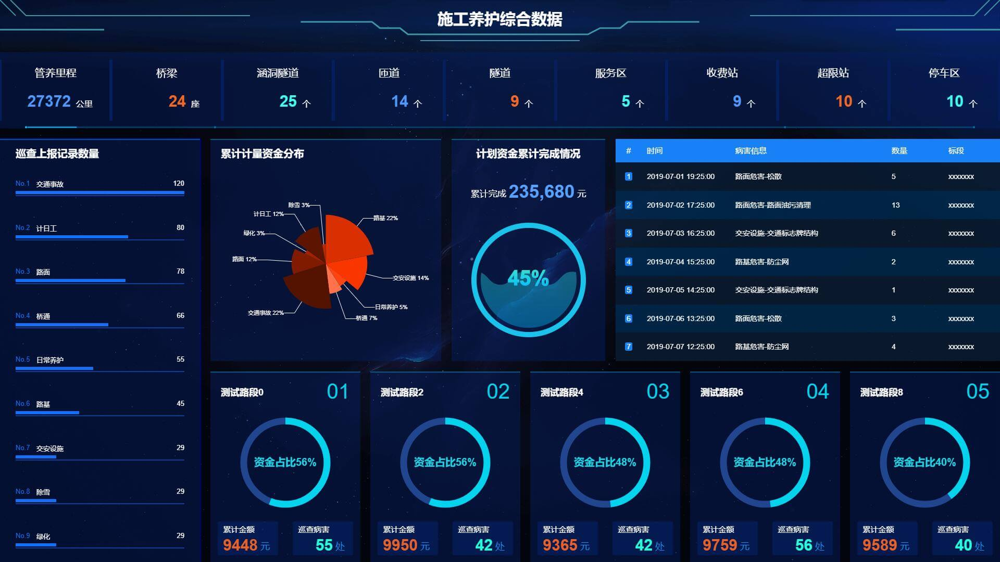
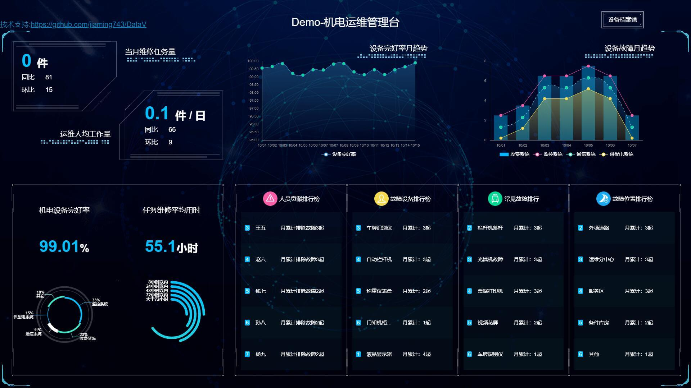
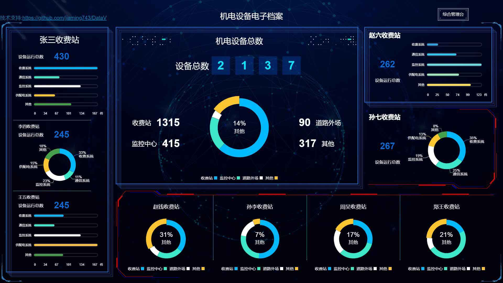

[ENGLISH](./README_EN.md)

<h1 align="center">DataV</h1>
<p align="center">
    <a href="https://github.com/jiaming743/datav/blob/master/LICENSE">
      
    </a>
    <a href="https://www.npmjs.com/package/@jiaminghi/data-view">
      
    </a>
</p>

## DataV是干什么的?

* DataV是一个基于**Vue**的数据可视化组件库.
* 提供用于提升页面视觉效果的**SVG**边框和装饰.
* 提供常用的**图表**如折线图等.
* 飞线图/轮播表等其他组件.

### npm安装

```shell
$ npm install @jiaminghi/data-view
```

### 使用

```js
import Vue from 'vue'
import DataV from '@jiaminghi/data-view'

Vue.use(DataV)

// 按需引入
import { borderBox1 } from '@jiaminghi/data-view'
Vue.use(borderBox1)
```

详细文档及示例请移步[HomePage](http://datav.jiaminghi.com).

### Demo

Demo页面使用了全屏组件，请F11全屏后查看。

* [施工养护综合数据](http://datav.jiaminghi.com/demo/construction-data/index.html)



* [机电运维管理台](http://datav.jiaminghi.com/demo/manage-desk/index.html)



* [机电设备电子档案](http://datav.jiaminghi.com/demo/electronic-file/index.html)


